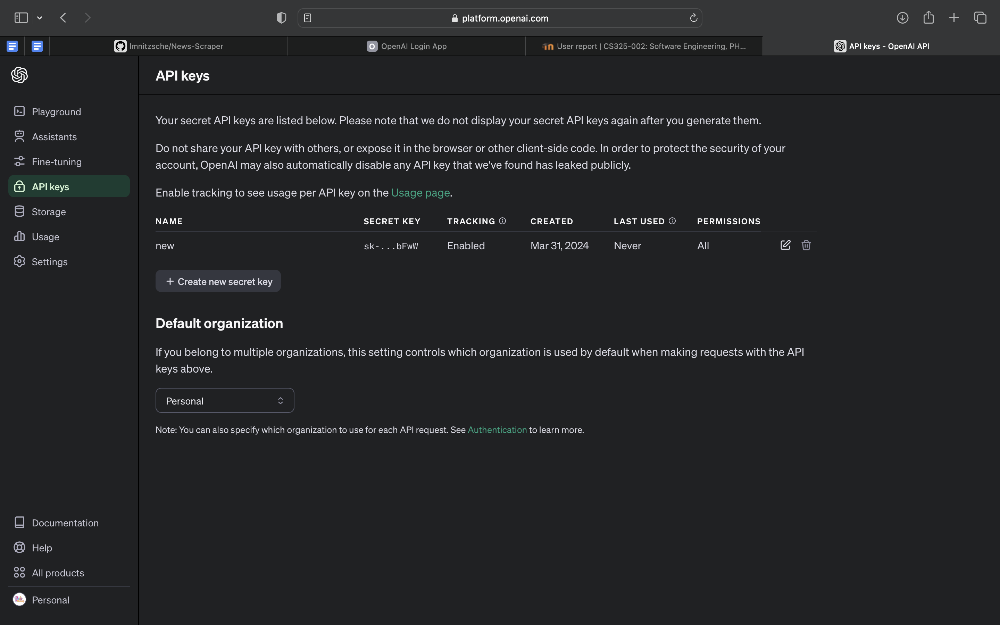

# Website Scrapper

The News Scraper and Article Generator is a Python script that allows one to scrape text content from news articles on the web. It utilizes the `requests` library to fetch HTML content from specified URLs, the `BeautifulSoup` library for HTML parsing, and the OpenAI API (`openai`) for generating concise summaries of news articles. The OpenAi API (`openai`) creates a title along with a 50 word summary of the content found in `Data/generated` and processses the summary into `Data/concised`. This script can be particularly useful for tasks such as data analysis, building intelligent agents, or simply staying up-to-date with news articles without having to scroll through advertisements.


## How to Install the Environment

Follow these steps to run the News Scraper:

1. Download the requirements.yaml

2. From the command line, import the environment using conda:
```console
conda env create --name my-new-env --file requirements.yml
```


## How to Run the Program

1. Open up the environment
   - You want activate the new environment from the command line as followed:
```console
conda activate my-new-env
```

2. Replace the `raw/articles.text` with your articles text file
```python
with open('Data/raw/articles.text','r') as file:
    urls = file.readlines()
```

3. Create an .env file inside the root directory folder (CS325_P2)
   - Inside the .env file, write out the following code:
```console
OPENAI_API_KEY="YOUR_API_KEY"
```

4. From inside the activated environment, run the python program:
```console
python websiteScrapper.py
```

5. Output the html file containing your scrapped articles
   - navigate to the directory "webpage_creation" and run:
```console
python webpage_creation.py
```


## How to Generate OpenAI API Key

1. **Sign Up for an Account on OpenAI**:
   - Visit the [OpenAI website](https://openai.com) and sign up for an account.

2. **Choose API Module**:
   - After creating an account with OpenAI, you will be prompted with an option to choose between navigating to "ChatGPT" or "API"; choose "API".
   

3. **Generate an API Key**:
   - After signing up, navigate to the API section in your account settings.
   - Generate an API key that will allow you to make API calls to the OpenAI API.
   

4. **Use the API Key**:
   - Once you have your API key, you can use it in line 21 of the `ai_processor.py` script to access the OpenAI API for generating concise summaries of news articles.


## Output
Upon successful execution, the script will download the text content from the news articles specified in the `links.txt` file located in the folder `Data` and subfolder `raw`. Furthermore, each article's content will be saved to the folder `Data` and subfolder `processed`. Additionally, the extracted content from each article will be used to generate summaries using the `openai` API, and these summaries will be saved to the folder `Data` and subfolder `concised`.

By following these steps, you can easily scrape news articles, extract text content, generate summaries using AI, and save the processed data for further analysis or consumption. Ensure to provide valid URLs in the `articles.text` file found in the `raw` subfolder in the `Data` folder for the script to fetch the content properly.
